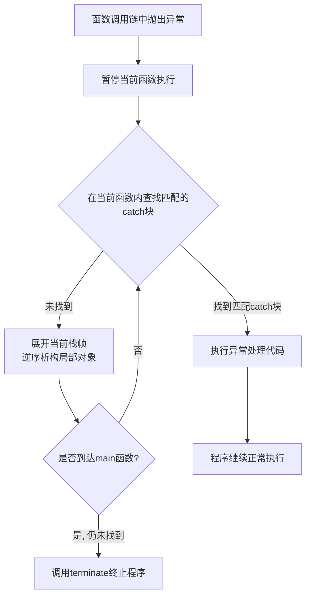

<!-- markdownlint-disable MD025 -->

# 栈展开 (Stack Unwinding)

`栈展开（Stack Unwinding）`是C++异常处理机制的核心环节，它确保了当程序遇到意外错误时，能够有序地清理资源，防止内存泄漏。下面这个流程图清晰地展示了栈展开的完整过程。

## Refer

- [Stack Unwinding](https://www.bogotobogo.com/cplusplus/stackunwinding.php)
