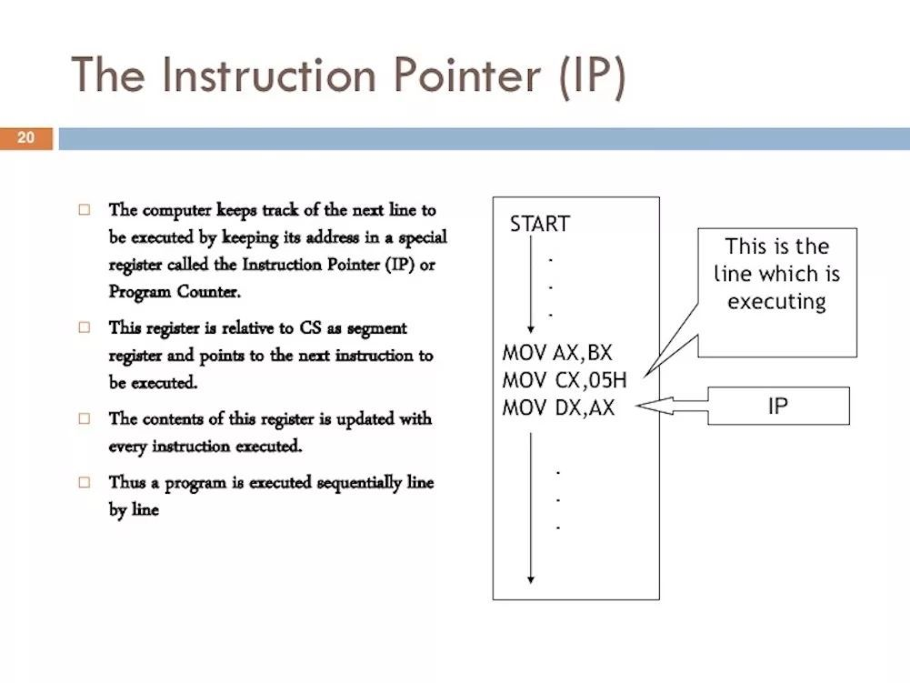
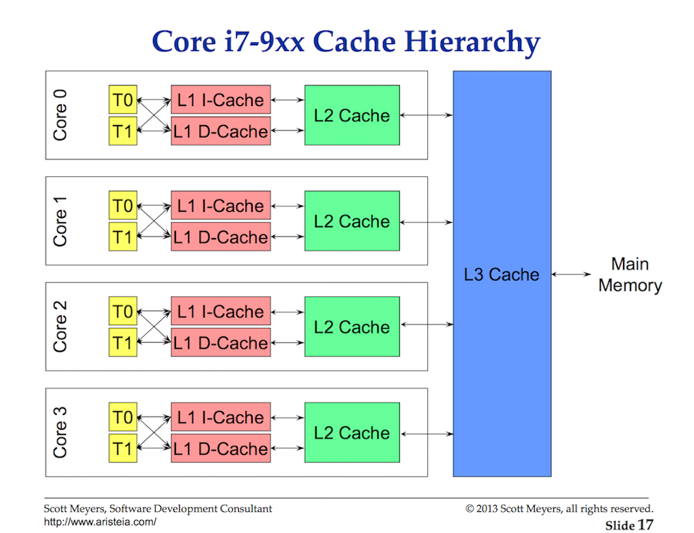
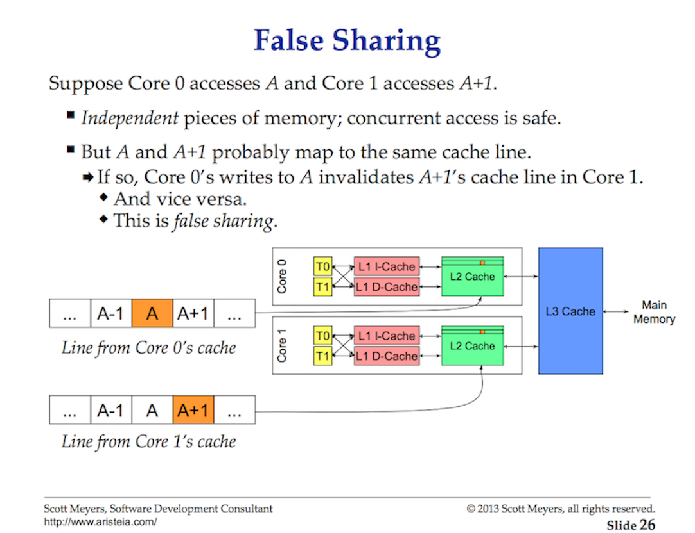
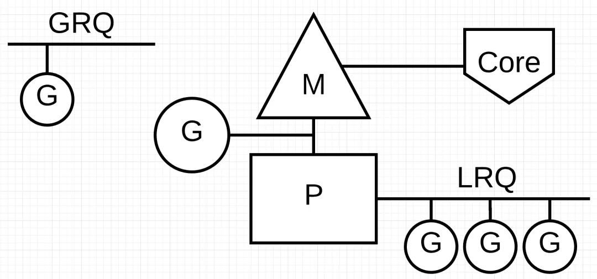

<!-- markdownlint-disable MD025 MD010-->

# Go 中的调度

功能介绍 Go 语言专门针对多处理器系统应用程序的编程进行了优化，使用 Go 编译的程序可以媲美 C 或 C++代码的速度，而且更加安全、支持并行进程。

## 第 I 部分 - OS 调度器

### 简介

golang 调度器的设计行为能够使你的多线程 go 程序更有效率、性能更好，这要归功于 golang 调度器对于操作系统调度器的支持。对于一个 golang 开发者来说，同时深刻理解操作系统调度和 golang 调度器工作原理，能够让你的 golang 程序设计和开发走到正确道路上。

### 操作系统调度器

操作系统调度器十分复杂，它必须要考虑到它所运行的底层硬件层级结构，包括但不限于处理器数和内核数，cpu cache 和 NUMA(非统一内存访问架构)。如果不考虑这些因素，调度器就没办法尽可能有效的工作。好事情是，你不必深入理解这些底层内容也能开发出好的程序。

你的程序其实就是一堆按顺序执行的机器指令。为了能让其正常干活，操作系统使用了线程的概念。线程会处理并执行分配给它的一系列的机器指令。线程会一直执行这些机器指令，直到没有指令再去给线程执行了。这也是为什么把线程称作"a path of execution"。

你运行的每个程序都会创建一个 Process 并且每个 Process 都会有一个初始 Thread。Thread 能够创建更多的 Thread。这些不同的 Thread 独立运行并且调度行为是 Thread 级别做决定的，而不是在 Process 级别。Thread 能够并发的执行(并发是说一个单独内核上每个线程会轮询占用一段 cpu 时间),而不是并行执行(在不同内核上同时执行)。线程同时会维持它自己的状态，并且能够在本地安全、独立地执行他自己的指令。这也说明了为什么线程是 cpu 调度的最小单位。

操作系统调度器，负责确保在有线程能够运行的时候内核不会空闲下来。它必须要制造出这样一种错觉——所有能够跑的线程此时都在同时执行。为了制造这种错觉，调度器需要优先执行高优先级的线程，但是它也必须保证低优先级的线程不会饿死(永远没有执行机会)。调度器也必须通过做出更聪明的决定将调度延时尽可能地最小化。

幸运的是计算机发展了这么长时间，许多算法的应用使得调度器更加高效。为了能够理解上面的事情，需要解释一些重要的概念。

### 执行指令

程序计数器(PC)，有时候也叫做指令指针(IP)，能够让你找到下一个要执行的指令在哪。大部分的处理器里，PC 指向下一个指令，而不是当前的指令。

**图 1**



如果你曾经注意到 go 程序的追踪栈，你会注意到这些每一行末尾的 16 进制数字。例如 Listing 1 里的+0x39 和+0x72

**Listing 1**

```shell
goroutine 1 [running]:
   main.example(0xc000042748, 0x2, 0x4, 0x106abae, 0x5, 0xa)
       stack_trace/example1/example1.go:13 +0x39                 <- LOOK HERE
   main.main()
       stack_trace/example1/example1.go:8 +0x72                  <- LOOK HERE
```

这些数字代表了 PC 值，也就是从各自函数开始的偏移量。+0x39 PC 偏移量代表了程序在还未 panic 的时候，线程在 example 方法执行的下一条指令。+0x72 PC 偏移量代表如果 example 函数回到 main 函数里，main 里的下一条指令。重要的是，指向指令的前一个指针告诉了你现正在执行什么指令

查看 Listing2 中的程序，该程序导致清单 1 中的堆栈跟踪。

**Listing 2**

```text
https://github.com/ardanlabs/gotraining/blob/master/topics/go/profiling/stack_trace/example1/example1.go

07 func main() {
08     example(make([]string, 2, 4), "hello", 10)
09 }

12 func example(slice []string, str string, i int) {
13    panic("Want stack trace")
14 }
```

十六进制数+0x39 表示 example 函数内部指令的 PC 偏移量，该指令比函数的起始指令低 57（基数 10）字节。在下面的 Listing 3 中，你可以看到一个 objdump 对的 example 从二元函数。找到第 12 条指令，它在底部列出。注意该指令上面的代码行是对它的调用 panic。

**Listing 3**

```shell
$ go tool objdump -S -s "main.example" ./example1
TEXT main.example(SB) stack_trace/example1/example1.go
func example(slice []string, str string, i int) {
  0x104dfa0		65488b0c2530000000	MOVQ GS:0x30, CX
  0x104dfa9		483b6110		CMPQ 0x10(CX), SP
  0x104dfad		762c			JBE 0x104dfdb
  0x104dfaf		4883ec18		SUBQ $0x18, SP
  0x104dfb3		48896c2410		MOVQ BP, 0x10(SP)
  0x104dfb8		488d6c2410		LEAQ 0x10(SP), BP
	panic("Want stack trace")
  0x104dfbd		488d059ca20000	LEAQ runtime.types+41504(SB), AX
  0x104dfc4		48890424		MOVQ AX, 0(SP)
  0x104dfc8		488d05a1870200	LEAQ main.statictmp_0(SB), AX
  0x104dfcf		4889442408		MOVQ AX, 0x8(SP)
  0x104dfd4		e8c735fdff		CALL runtime.gopanic(SB)
  0x104dfd9		0f0b			UD2              <--- LOOK HERE PC(+0x39)
```

注意: PC 始终是下一个指令，不是当前指令。Listing Listing3 很好的说明了 amd64 下面，go 线程是如何执行指令序列的。

### 工作类型

线程有两种工作类型。第一种叫 CPU 密集型，第二种叫 IO 密集型

**CPU 密集型(cpu-bound):**

这种工作下，线程永远不会被置换到等待(waiting)状态。这种一般是进行持续性的 cpu 计算工作。比如计算 Pi 这种的就是 cpu 密集型工作

**IO 密集型(io-bound)：**这种工作会让线程进入到等待(waiting)状态。这种情况线程会持续的请求资源（比如网络资源）或者是对操作系统进行系统调用。线程需要访问数据库的情况就是 IO 密集型工作。同时我会把同步事件(例如 mutexes、atomic)，这种需要线程等待的情况归入此类工作。

### 上下文切换(Context Switch)

如果你的程序运行在 Linux、Mac 或者是 Windows 上面，你的调度器则是抢占式的。这意味着一些重要的事情。第一、它意味着调度器不会预先知道此时此刻会运行哪个线程。线程优先级加上事务(例如接受网络数据)让调度器无法确定哪个时间执行哪个线程。

其次、你永远不能按照历史经验去看，你之前幸运跑出来的代码其实不能保证每次都按你所想去执行。如果你的代码 1000 次都是按照同样方式执行，你很容易以为下次也保证按照一样方式执行。如果你的程序需要确定性的话，你一定要控制线程的同步和编排。

在内核上切换线程的物理行为叫做上下文切换(context switch)。上下文切换发生在这样的情况，调度器从内核换下正在执行的线程，替换上可执行的线程。线程是从运行队列中取出，并设置成执行中(Executing)的状态。从内核上下来的线程会置成可运行状态,或者是等待状态。

上下文切换的代价是昂贵的，因为它需要花时间去交换线程，从内核上拿下来再放上去。上下文切换的延时受到很多因素影响，但是通常情况下，它会有 1000--1500 纳秒的延时。考虑到硬件上每个内核上平均每纳秒执行 12 个指令，一次上下文切换会花费你 12k--18k 个指令延时。这本质上来说，你的程序在上下文切换过程中失去了执行大量指令的机会。

如果你的程序集中于 IO 密集型(cpu-bound)的工作，上下文切换会相对有利。一旦一个线程进入到等待(waiting)状态。另一个处于可运行(Runnable)状态的线程会取代它的位置。这会使得内核始终是处于工作状态。这是调度器调度的一个重要方面，如果有事做(有线程处于可运行状态)就不允许内核闲下来。

如果你的程序集中于 cpu 密集型(cpu-bound)的工作，那么上下文切换会是性能的噩梦。因为线程要一直做事情，上下文切换会停止正在处理的工作。这种情况和 IO 密集型形工作成鲜明对比。

### 线程状态

另一个重要概念就是“线程状态”，线程状态说明了调度器该如何处理此时的线程。线程有三个状态:Waiting，Runnable 或 Executing。

**等待(Waiting)：**此时意味着线程停止并且等待被唤醒。可能发生的原因有，等待硬件(硬盘、网络)，操作系统(系统调用) 或者是同步调用(atomic,mutexes)。这些情况是导致性能问题的根源

**可运行(Runnable)：**此时线程想要占用内核上的 cpu 时间来执行分配给线程的指令。如果你有许多线程想要 cpu 时间，线程必须要等一段时间才能取到 cpu 时间。随着更多线程争用 cpu 时间，线程分配的 cpu 时间会更短。这种情况下的调度延时也会造成性能问题。

**执行中(Executing):**此时线程已经置于内核中，并且正在执行它的机器指令。应用程序的相关内容正在被处理。这种状态是我们所希望的

### 找到平衡点

你需要在内核数量和你的线程数量两者间，找到一个能够让你的程序获得最好吞吐量的平衡点。想要去找到这样的平衡点，线程池是一个很好的选择。

使用 go 之前，作者使用 C++和 c#在 NT 上。在那个操作系统里，使用 IOCP(IO Completion Ports) 线程池对于写多线程软件十分重要。作为一个工程师，你需要计算出你要用多少个线程池，以及每个线程池的最大线程数，从而在确定了内核数的系统里最大化你的吞吐量。

当写 web 服务时候，你需要和数据库通信。3 是一个魔法数字，每个内核设置 3 个线程似乎在 NT 上有最好的吞吐量。换句话说，每内核 3 线程能够最小化上下文切换的延时，最大化在内核上的执行时间。当你创建一个 IOPC 线程池，我知道我可以在主机上设置每个内核 1--3 个线程数量。

如果我使用 2 个线程每个内核，完成工作的时间会变长，因为本来需要有工作去做的内核会有空闲时间。如果我每个内核用 4 个线程，也会花更长时间，因为我需要花更多时间进行上下文切换。平衡数字 3，不管是什么原因，似乎在 NT 上都是一个神奇的数字。

当你的服务需要处理许多不同类型的工作会如何呢。那会有不同并且不一致的延迟。可能它会产生许多需要去处理的不同系统级别的事件。这种情况，你不可能去找到一个魔法数字，能让你在所有时间所有不同的工作情况下都有优秀的性能。当你使用线程池的时候，找到一个合适的配置会十分复杂。

### 少即是多(Less Is More)

在早期时候，处理器仅仅只有一个内核，调度器并不十分复杂。因为你有一个单独的处理器，一个单独的内核，所以任何时间只能跑一个线程。方法是定义一个调度期(scheduler period) 然后尝试在一个调度期内去执行所有可运行(Runnable)的线程。这样没问题:把调度期按照需要执行的线程数量去分每一小段。

例如，如果你定义了你的调度期是 10ms，并且你有两个线程，那每个线程会分到 5ms。5 个线程的话，每个线程就是 2ms。但是如果你有 100 个线程会怎么样？每个线程时间片是 10us(微秒), 这就会无法工作，因为你需要大量时间去进行上下文切换(context switches)。

在最后一个场景，如果最小的时间切片是 2ms 并且你有 100 个线程，调度期需要增加到 2000ms 也就是 2s。要是如果你有 1000 个线程呢，现在调度期需要 20s，也就是你要花 20s 才能跑完所有的线程如果每个线程都能跑满它的时间切片。上面发生的是显而易见的事情。调度器在做决定的时候还要考虑到更多的因素。你控制了应用程序里的线程数量，当有更多线程的时候，并且是 IO 密集(IO-Bound)工作，就会有更多的混乱和不确定行为发生，调度和执行就花费更多时间。

这也是为什么说游戏规则就是“少即是多(Less is More)”，可运行线程越少意味着调度时间越少，线程得到的时间越多。更多的线程就意味着每个线程获得的时间就越少，分配的时间内做的事情也就越少。

### 调度决策场景

想象一下，我已经要求你根据我给你的高级信息编写 OS 调度程序。想想你必须考虑的这种情况。

你启动了你的应用程序，主线程已经在 core1 上启动。当线程正在执行，他需要去检索 cache 行因为需要访问数据。这个 Thread 现在决定为了某些并发处理创建一个新的线程。那么问题来了。一旦线程创建好，并且准备要运行了，那么调度器是否应该:

1、从 core1 上换下 main 主线程？这样做有助于提高性能，因为这个新线程需要的相同数据被缓存的可能性非常大。但是主线程并没有得到它的全部时间片。

2、线程是否要一直等待直到 main 主线程完成它的时间后 core1 可用？线程并没有在运行，但是一旦运行它获取数据的延时将会消除。

3、线程等待下一个可用的 core？这意味着所选择的 core 的 cache 行会经历冲刷、检索、复制，从而导致延迟。但是线程会更快的启动，并且主线程会完成它的时间片。

这些都是调度器在做决定时需要考虑到的一些有趣问题。我能告诉你的事情就是，如果有空闲的内核，它将会被使用。你希望当线程能够运行的时候它就会运行。

### 缓存行(Cache Lines)

从主存访问数据有很高的延迟（大概 100300 个时钟周期），因此处理器和内核会有缓存，能够让线程访问到更近的数据。从缓存访问数据的延迟非常低(大概 340 个时钟周期) 根据不同的缓存访问方式。衡量性能的一个方面就是，处理器通过减少数据访问延时而获取数据的效率。编写多线程的应用程序需要考虑到机器的缓存系统。

**图 2**



处理器和主存使用缓存行(cache lines)进行数据交换。一个缓存行是一个 64 byte 的内存块，它在内存和缓存系统之间进行交换。每个内核会分配它自己需要的 cache 副本，也就是意味着硬件使用的是值语义(区别于指针语义)。这也是为什么多线程中的内存突变会造成严重的性能问题。

当并行运行的多个线程访问相同的数据值或甚至是彼此接近的数据值时，它们将访问同一缓存线上的数据。在任何核心上运行的任何线程都将获得其自己的同一缓存行的副本。

**图 3**



如果给一个内核，他上面的线程修改它的 cache 行副本，然后会通过硬件的神奇操作，同一 cache 行的所有其他副本都会被标记为无效。当一个线程尝试读写无效 cache 行，主存需要去访问去获取新的 cache 行副本(大约要 100~300 个时钟周期)

也许在 2 核的处理器上这不是大问题，但是如果是一个 32 核处理器并行跑 32 个线程，并且同时访问和修改一个相同的 cache 行呢？由于处理器到处理器之间的通信延迟增加，情况会更糟。程序内存会发生颠簸，并且性能很差，而且很可能你也不知道为什么会这样。

这就是 cache 的一致性问题（ cache-coherency problem ）或者是说是共享失败（false sharing）。当编写改变共享状态的多线程应用时，cache 系统必须要考虑在内。

### 结论

这是第一部分，为你提供了一些多线程编程时要考虑到线程和 OS 调度器的一些理解。这同时也是 golang 调度器需要考虑的事情。下面一部分，我会描述 Go 调度器的一些相关知识。

## 第 II 部分 - Go Scheduler

### 简介

第一篇文章解释了关于操作系统层级的调度，我认为这对于理解 Go 的调度是很重要的。这一部分我会在语义层级解释 Go 调度器是如何工作的，并且着重关注它的一些高级行为。Go 调度器是一个十分复杂的系统，细节不重要，重要的是对于其工作和行为有一个好的理解,这会让你做出更好的工程方面的决定。

### 从一个程序开始

当你的 go 程序启动，主机上定义的每一个虚拟内核都会为它分配一个逻辑处理器(P)，如果你的处理器上每个物理内核有多个硬件线程（超线程），每个硬件线程对于你的 go 程序来说就是一个虚拟内核。为了理解这个事情，看一下我的 MacBook Pro 的系统配置。

```plaintext
Hardware Overview:
Model Name: MacBook Pro
Model Identifier: MacBookPro13,3
Processor Name: Intel Core i7
Processor Speed: 2.9 GHz
Number of Processors: 1
Total Number of Cores: 4
L2 Cache (per Core): 256 KB
L3 Cache: 8 MB
Memory: 16 GB
```

你可以看到一个单独处理器有 4 个物理核心。配置表没有显示每个物理核心有多少个硬件线程。Intel Core i7 处理器有自己的超线程，也就是每个物理内核上有两个硬件线程。因此 Go 程序知道并行执行操作系统线程的时候，会有 8 个虚拟内核可以用

为了测试这一点，看一下下面的程序

**Listing 1**

```golang
package main

import (
    "fmt"
    "runtime"
)

func main() {

    // NumCPU returns the number of logical
    // CPUs usable by the current process.
    fmt.Println(runtime.NumCPU())
}
```

当我在本机上运行这个程序，NumCPU()方法会返回 8，我在本机上跑的任何 Go 程序会分配 8 个逻辑处理器(P)。

每个 P 会分配一个 OS 线程（M）。M 代表机器(machine)。这个线程是 OS 来处理的并且 OS 还负责把线程放置到一个 core 上去执行。这意味着当我跑一个 Go 程序在我的机器上，我有 8 个可用的线程去执行我的工作，每个线程单独连到一个 P 上。

每个 Go 程序同时也会有一个初始的 Goroutine（G）。一个 Goroutine 本质上是一个协程（Coroutine），但是在 go 里，把字面"C"替换为"G"所以我们叫 Goroutine。你可以认为 Goroutine 是一个用户程序级别的线程而且它跟 OS 线程很多方面都类似。区别仅仅是 OS 线程在内核(Core)上进行上下文切换（换上和换下）,而 Goroutines 是在 M 上。

最后一个让人困惑的就是运行队列。在 Go 调度器中有两种不同的运行队列：全局运行队列（GRQ）和本地运行队列(LRQ)。每个 P 会分配一个 LRQ 去处理 P 的上下文要执行的 Goroutines 。这些 Goroutines 会在绑定到 P 的 M 上进行上下文的切换。GRQ 会处理还没有分配到 P 上的 Goroutines 。Goroutines 从 GRQ 挪到 LRQ 的过程一会我们一会儿会说。

图 2 提供了所有这些组件的图像。

**图 2**


### 协作调度

我们在第一部分的内容讲到了，OS 调度器是一个抢占式调度器。也就是说你不知道调度器下一步会执行什么。内核所做的决定都是不确定的。运行在 OS 顶层的应用程序无法控制内核里面的调度，除非你使用同步的原始操作，例如 atomic 指令和 mutex 调用。

Go 调度器是 Go runtime 的一部分，Go runtime 会编译到你应用程序里。这意味着 Go 调度器运行在内核之上的用户空间(user space) 当前 Go 调度器采用的不是抢占式调度器，而是协作试调度器。协作试调度器，意味着调度器需要代码中安全点处发生的定义好的用户空间事件去做出调度决策。

Go 的协作调度有一个非常棒的地方就是，它看上去像是抢占式的。你没办法预测 Go 调度器将要做什么，这是因为协作试调度器的决策不是开发人员而是 go runtime 去做的。将 Go 调度器看做是一个抢占式调度器是很重要的，因为调度是不确定的，这里不需要再过多延伸。

### Goroutine 状态

和线程一样。Goroutine 有三种相同的高级状态。Goroutine 可以是任何一种状态：等待（Waiting）、可执行（Runnable）、运行中（Executing）。

等待：此时 Goroutine 已经停止并且等待事件发生来去再次执行。这可能是出于等待操作系统（系统调用）或同步调用（原子操作 atomic 和互斥操作 mutex）等原因。这些类型的延迟是性能不佳的根本原因。

可执行：此时 Goroutine 想要在 M 上执行分配给它的指令。如果有很多 Goroutines 想要 M 上的时间片，那么 Goroutines 必须等待更长时间。而且，随着更多 Goroutines 争夺时间片，单独 Goroutines 分配的时间就会缩短，这种类型的调度延时也会导致性能很差。运行中：这意味着 Goroutines 已经放置在 M 上并且执行它的指令。此时应用程序的工作即将完成，这是我们想要的状态。

### 上下文切换（Context Switching）

Go 调度程序需要明确定义的用户空间事件，这些事件发生在代码中的安全点以进行上下文切换。这些事件和安全点在函数调用时发生。函数调用对 Go 调度器的运行状况至关重要。Go 1.11 或者更低版本中，如果你跑一个不做函数调用的死循环，会导致调度器延时和垃圾回收延时。合理的时机使用函数调用十分重要。

注意：相关 issue 和建议已经被提出来，并且应用到了 1.12 版本中。应用非协作的抢占式技术，使得在 tight loop 中进行抢占。

Go 程序中有 4 种类型的事件，允许调度器去做出调度决策。这不意味着某一个事件总是会发生，而是说调度器有机会去做出调度。

\*使用关键字 go \*垃圾回收 \*系统调用 \*同步处理

#### 使用关键字 go

使用关键字 go 来创建 Goroutine。一旦一个新的 Goroutine 创建好，调度器便有机会去做出调度决定

#### 垃圾回收

GC 时候会有它自己的 Goroutines，这些 Goroutines 也需要 M 上的时间片。这会导致 GC 产生很多调度混乱。但是调度器很聪明，它知道 Goroutines 在做什么，然后会做出合理的调度决策。一个聪明的决定就是对那些想要触及到堆的 Goroutine 和 GC 时候不会触及堆的 Goroutine 进行上下文切换。GC 发生的时候会产生很多调度决策。

#### 系统调用

如果一个 Goroutine 做出了会导致 M 阻塞的系统调用，调度器有时候会用一个新的 Goroutine 从 M 上替换下这个 Goroutine。但是有时候会需要一个新的 M 去执行挂在 P 队列上的 Goroutine，这种情况我会在下一部分讲解。

#### 同步处理

如果 atomic、mutex 或者是 channel 操作的调用导致了 Goroutine 的阻塞，调度器会切换一个新的 Goroutine 去执行。一旦那个 Goroutine 又可以重新执行了，他会被挂到队列上并最终在 M 上会上下文切换回去。

### 异步系统调用

当 OS 有能力去处理异步的系统调用时候，使用网络轮询器(network poller)去处理系统调用会更加高效。不同的操作系统分别使用了 kqueue (MacOS)、epoll (Linux) 、 iocp (Windows) 对此作了实现。今天许多操作系统都能处理基于网络(Networking-based)的系统调用。这也是网络轮询器(network poller)这一名字的由来，因为它的主要用途就是处理网络操作。网络系统上通过使用 network poller，调度器可以防止 Goroutines 在系统调用的时候阻塞 M。这可以让 M 能够去执行其他在 P 的 LRQ 上面的其他 Goroutines 而不是再去新建一个 M。这可以减少 OS 上的调度加载。最好的方式就是给一个例子看看它是如何工作的。

**图 3**
 image

图 3 展示了基本的调用图例。Goroutine-1 正在 M 上面执行并且有 3 个 Goroutine 在 LRQ 上等待想要获取 M 的时间片。network poller 此时空闲没事做。

**图 4**
 image

图 4 中 Goroutine-1 想要进行 network system 调用，因此 Goroutine-1 移到了 network poller 上面然后处理异步调用，一旦 Goroutine-1 从 M 上移到 network poller，M 便可以去执行其他 LRQ 上的 Goroutine。此时 Goroutine-2 切换到了 M 上面。

**图 5**

图 5 中，network poller 的异步网络调用完成并且 Goroutine-1 回到了 P 的 LRQ 上面。一旦 Goroutine-1 能够切换回 M 上，Go 的相关代码便能够再次执行。很大好处是，在执行 network system 调用时候，我们不需要其他额外的 M。network poller 有一个 OS 线程能够有效的处理事件循环。

### 同步系统调用

当 Goroutine 想进行系统调用无法异进行该怎么办呢？这种情况下，无法使用 network poller 并且 Goroutine 产生的系统调用会阻塞 M。很不幸但是我们无法阻止这种情况发生。一个例子就是基于文件的系统调用。如果你使用 CGO，当你调用 C 函数的时候也会有其他情况发生会阻塞 M。

注意：Windows 操作系统确实有能力去异步进行基于文件的系统调用。从技术上讲，在 Windows 上运行时可以使用 network poller。我们看一下同步系统调用(比如 file I/O)阻塞 M 的时候会发生什么。

**图 6**
 image

图 6 又一次展示了我们的基本调度图例。但是这一次 Goroutine-1 的同步系统调用会阻塞 M1

**图 7**
 image

图 7 中，调度器能够确定 Goroutine-1 已经阻塞了 M。这时，调度器会从 P 上拿下来 M1，Goroutine-1 依旧在 M1 上。然后调度器会拿来一个新的 M2 去服务 P。此时 LRQ 上的 Goroutine-2 会上下文切换到 M2 上。如果已经有一个可用的 M 了，那么直接用它会比新建一个 M 要更快。

**图 8**
 image

图 8 中，Goroutine-1 的阻塞系统调用结束了。此时 Goroutine-1 能够回到 LRQ 的后面并且能够重新被 P 执行。M1 之后会被放置一边供未来类似的情况使用。

### 工作窃取（Work Stealing）

调度器的另一个层面，它其实也是一个 work-stealing 的调度器。这在一些情况下能够让调度更有效率。你最不想看到的事情是一个 M 进入了等待状态，因为这一旦发生，OS 将会把 M 从 core 上切换下来。这意味着即使有可执行的 Goroutine， P 此时也没法干活了，直到 M 重新切换回 core 上。Work stealing 同时也会平衡 P 上的所有 Goroutines 从而能够使工作更好的分配，更有效率。让我们看一个例子

**图 9**

图 9 里，我们有个多线程的 Go 程序。两个 P 分别服务 4 个 Goroutines。并且一个单独的 Goroutine 在 GRQ 上。那么如果其中一个 P 很快执行完它所有的 Goroutines 会怎么样？

**图 10** 

P1 没有更多 Goroutine 去执行了，但是在 GRQ 和 P2 的 LRQ 中都有可执行的 Goroutines。这种情况 P1 会去窃取工作，Work Stealing 的规则如下

**Listing 2**

```go
    runtime.schedule() {
        // only 1/61 of the time, check the global runnable queue for a G.
        // if not found, check the local queue.
        // if not found,
        //     try to steal from other Ps.
        //     if not, check the global runnable queue.
        //     if not found, poll network.
    }
```

所以基于 Listing2 的规则，P1 需要去看 P2 的 LRQ 上的 Goroutines 并且拿走一半。

**图 11** 

图 11 中，一半的 Goroutines 从 P2 上偷走，P1 现在可以执行那些 Goroutines 如果 P2 完成了所有 Goroutines 的执行，并且 P1 的 LRQ 上已经空了会怎么样？

**图 12**
 image

图 12 中，P2 完成了它所有的工作，现在想要偷点什么。首先，它会去看 P1 的 LRQ 却发现什么也没有了。接下来他会去看 GRQ。他会找到 Goroutine-9

**图 13** 

图 13 中，P2 从 GRQ 上偷走了 Goroutine-9 并且开始执行它的工作。这种 work stealing 的很大好处是，它让 M 一直有事情做而不是闲下来。这种 work stealing 可以看做内部的 M 的轮转，这种轮转的好处在这篇博客里做了很好的解释。

### 实际例子

我想让你看一下 Go 调度器为了在同一时间里做更多事情，这一切是如何一块发生的。首先想象这样一个多线程的 C 语言应用，程序需要处理两个 OS 线程，他们俩互相进行通信。

**图 14**
 image

图 14 中，有两个线程，相互通信。线程 1 上下文切换到 Core1 上并且现在正在执行，这允许线程 1 向线程 2 发送消息。注意：通信方式不重要。重要的是这个过程里的线程状态。

**图 15** 

在图 15 中，一旦线程 1 完成发送消息，它就需要等待响应。这会导致线程 1 从 Core1 切换下来并处于等待状态。一旦线程 2 收到消息通知，它就会进入可执行的状态。现在 OS 进行上下文切换然后线程 2 在一个 Core2 上面执行。接下来线程 2 处理消息然后给线程 1 发送一个新消息。

**图 16**
 image

图 16 里。随着线程 1 收到线程 2 的消息，又一次发生了上下文切换。现在线程 2 从执行中的状态切换为等待的状态。并且线程 1 从等待状态切换到了可执行状态，最终回到运行状态。现在线程 1 可以处理并发送一个新消息回去。

所有的上下文切换(context switches)和状态的改变都需要花费时间去处理，这就限制了工作速度。每一次上下文切换 会导致 50ns 的潜在延迟，硬件执行指令的期望时间是每 ns 12 个指令，你会看到上下文切换的时候就少执行 600 个指令。因为这些线程在不同的 core 之前切来切去，cache-line 未命中导致的延迟也会增加。

我们来看一下相同例子，使用 Goroutines 和 Go 调度器做替换。

**图 17** 

图 17 中，有两个 Goroutines 相互传递消息。G1 上下文切换到 M1 上进行工作处理，之前这都是在 Core1 上发生的事情。现在是 G1 向 G2 发送消息。

**图 18** 图 18 中，一旦 G1 发送完消息，它就会等待响应返回。这会让 G1 从 M1 上切换下来，并且进入到等到状态。一旦 G2 收到消息通知，它会进入可执行状态。现在 Go 调度器会把 G2 切换到 M1 上去执行，M1 依旧在 Core1 上跑着。接下来 G2 处理消息然后给 G1 发送一个新消息。

**图 19** 

在图 19 中，随着 G1 收到 G2 发送来的消息，又一次发生上下文切换。现在 G2 从执行中的状态切换到等待状态并且 G1 从等待中切换到可执行状态，最终回到运行的状态，G1 又能够处理并向 G2 发送新的消息了。

表面上事情并没有什么不同。不论你使用线程还是 Goroutines 都有上下文切换和状态改变的过程。但是线程和 Goroutines 之间有一个重要的差别可能不会被明显注意到。在使用 Goroutines 的场景，整个过程一直使用的是相同的 OS 线程和 Core。这也就意味着，从 OS 的视角，OS 线程从来没有进入到 waiting 状态，一次也没有。结果就是我们在线程中上下文切换丢失的指令在 Goroutines 中不会丢失。

本质上讲，在 OS 层级 go 把 io/blocking 类型的工作转变成了 cpu 密集型的工作。由于所有上下文切换的过程都发生在应用程序的级别，上下文切换不会像线程一样丢掉 600 个指令（平均来说）。Go 调度器还有助于提高 cache-line 的效率和 NUMA。这也是为什么我们不需要比虚拟内核数更多的线程。在 Go 里，随着时间推移更多事情会被处理，因为 Go 调度器会尝试用更少的线程并且每个线程去做更多事情，这有助于减少 OS 和硬件层级的加载延迟。

### 结论

Go 调度程序的设计在考虑操作系统和硬件工作复杂性方面确实令人惊讶。在操作系统级别将 IO /blocking 工作转换为 CPU 密集型工作，是在利用更多 CPU 容量的过程中获得巨大成功的地方。这就是为什么你不需要比虚拟内核数更多的 OS 线程。每个虚拟内核一个 OS 线程情况下，你可以合理的期望你的所有工作(CPU 密集、IO 密集)都能够完成。对于网络程序和那些不需要系统调用阻塞 OS 线程的程序，也能够完成。

作为开发人员，你依旧需要理解在处理不同类型工作的时候你的程序正在做什么。你不能为了想要更好性能去无限制创建 goroutine。Less is always more，但是通过理解了 go 调度器，你可以更好的做出决定。下一部分，我会探讨以保守的方式利用并发来提升性能的方法，但是对于代码的复杂性还是要做出平衡。

## 第 III 部分 - 并发

### 简介

当我在解决一个问题尤其是新问题的时候，我开始不会去考虑并发(concurrency)是否合适。我首先会去找一系列的解决方式然后确保它有效。然后在可读性和技术方案评估之后，我会开始去考虑并发是否实际合理。有些时候并发的好处是显而易见的，但是有时候并不是很明显。第一篇文章，我解释了 OS 调度器的相关内容，我觉得这部分对于你写多线程代码很重要。第二篇里，我讲解了一些 Go 调度器的一些内容，这部分对于你理解和写 go 的并发代码很有帮助。在这篇文章里，我会在 OS 和 Go 调度器层面让你去深层次的理解并发到底是什么。这部分内容的目标是：

你的工作负载(workloads)使用并发是否合适，为此提供一些指导建议 不同工作负载的含义，并针对其作出相应的工程方面的决策。

什么是并发 并发的含义就是无序的执行。给你一系列的指令，去找到一个方式可以无序执行而且和有序执行产生同样的结果。这个问题在你面前，显而易见的是无序执行会增加一些足够的性能增益在计算了复杂性成本之后，但是你可能会觉得无序执行是不可能的甚至是没有意义的。你也要清楚一点，并发和并行是不一样的。并行是在相同时间内同时执行两个或两个以上的指令，这和并发的概念不一样。

**图 1**
 image

图 1 里，你看到主机上有两个逻辑处理器。每个都有他们单独的 OS 线程(M)依附于一个独立的硬件线程(Core)。你可以看到 2 个 Goroutine(G1 和 G2) 正在并行在各自的 OS/硬件线程上面同时执行它们的指令。在每个逻辑处理器里，有 3 个 Goroutines 以轮转的方式共享 OS 线程。这些 Goroutines 正在以无序的方式并发地执行它们的指令，并且在 OS 线程上共享时间片。

这里有一个问题。有些时候利用并发而不采用并行实际上会降低你的吞吐量，有趣的是，有时候利用并发同时加上并行处理也不会为你带来你理想中的性能增益。

### 工作负载(workloads)

你是如何知道无序执行(并发)是可行的呢？了解你所处理问题的工作负载(workload)是一个起点。有两种类型的工作负载在并发的时候要考虑到。

- CPU 密集(CPU-Bound)：这种工作负载情况不会有 Goroutines 自动切换到 waiting 状态的情况，也不会有自动从 waiting 状态切到其他状态的情况。这种情况发生在进行持续计算的时候。线程计算 Pi 值就是 CPU-Bound。

- IO 密集(IO-Bound)：这种工作负载会导致 Goroutines 自动进入等待状态。这种工作发生在持续地请求网络资源、或者是进行系统调用、或者是等待事件发生的情况。一个 Goroutines 需要读文件就是 IO-Bound。我把同步事件(mutexes，atomic)类似导致 Goroutine 等待的情况归到此类。

cpu-bound 的工作负载，你需要并行去使用并发。一个单独的 OS/硬件线程处理多个 Goroutines 效率很低，因为 Goroutines 在这个工作负载里不会主动进入或者是离开等待状态。Goroutines 数多于 OS/硬件线程数的时候会降低工作负载的执行速度，因为从 OS 线程换上或者是换下 Goroutines 会有延迟(切换的时间)。上下文切换会在 workload 里创建出"一切都停止"事件，因为在切换的时候你的所有 workload 都不会执行。

在 IO-Bound 的 workloads 里，你不需要并行去使用并发。一个单独 OS/硬件线程可以有效率地处理多个 Goroutines，因为 Goroutines 作为它自己 workload 的一部分可以自动进入或者离开等待状态(waiting)。Goroutines 数量多于 OS/硬件线程数可以加速 workload 的执行,因为 Goroutines 在 OS 线程上切换不会创建"一切都停止"事件。你的 workload 会自然停止并且这会让一个不同的 Goroutine 去有效率地使用相同的 OS/硬件线程，而不是让 OS/硬件线程空闲下来。

你如何知道每个硬件线程设置多少个 Goroutines 会有最好的吞吐量呢？太少的 Goroutines 你会有更多空闲时间。太多 Goroutines 你会有更多上下文切换延迟。这件事情你需要考虑，但是这超出了 本篇文章讲述的范围。

现在，我们需要看一些代码来巩固你去判断什么时候 workload 可以利用并发，以及什么时候需要利用并行什么时候不需要并行。

### 整数累加

不需要太复杂的代码，就看一下下面的 add 函数。它计算了一堆整数的和。

**Listing 1** <https://play.golang.org/p/r9LdqUsEzEz>

```go
36 func add(numbers []int) int {
37     var v int
38     for _, n := range numbers {
39         v += n
40     }
41     return v
42 }
```

在 Listing1 的 36 行，声明了 add 方法，他接受一个 int 型的 slice，然后返回它们的和。37 定义了一个变量 v 去做数字累加。38 行函数遍历这些整数，39 行把当前数加上去。最后 41 行返回它们的和。

问题: add 是否适合无序执行？我相信答案肯定是 yes。整数集可以被分解成更小的 lists，并且这些 lists 可以并行去处理。一旦所有 lists 都各自加完，这一系列 lists 的和可以加到一起，得到上面代码里一样的结果。

但是，另一个问题来了。我们应该分多少个 lists 去分别单独处理才能得到最好的吞吐量呢？为了回答这个问题，你需要知道 add 方法运行到底是哪种 workload。add 方法处理的是 CPU-Bound 类型的 workload 因为这是一个纯数学计算的方法，它不会导致 goroutines 进入自动等待状态。这意味着每个 OS/硬件线程一个 Goroutine 即可获得理想的吞吐量。

下面的 Listing2 是 add 方法的并发版本。

注意：你有多种方式去写 add 的并发版本，不必去纠结代码本身。

**Listing2**
<https://go.dev/play/p/r9LdqUsEzEz>

```go
44 func addConcurrent(goroutines int, numbers []int) int {
45     var v int64
46     totalNumbers := len(numbers)
47     lastGoroutine := goroutines - 1
48     stride := totalNumbers / goroutines
49
50     var wg sync.WaitGroup
51     wg.Add(goroutines)
52
53     for g := 0; g < goroutines; g++ {
54         go func(g int) {
55             start := g * stride
56             end := start + stride
57             if g == lastGoroutine {
58                 end = totalNumbers
59             }
60
61             var lv int
62             for _, n := range numbers[start:end] {
63                 lv += n
64             }
65
66             atomic.AddInt64(&v, int64(lv))
67             wg.Done()
68         }(g)
69     }
70
71     wg.Wait()
72
73     return int(v)
74 }
```

在 Listing2 里面，`addConcurrent`方法是`add`方法的并发版本。这里有很多代码因此我只讲解重要的代码行

**Line 48**：每个 Goroutine 会有它单独的一个小的 list 去处理。list 的 size 由整数集的 size 去除以 Goroutines 的数量得到。

**Line 53**：创建 goroutines 线程池去处理加数操作。

**Line 57-59**：最后一个 goroutines 会处理剩下的最后一个 list，它可能比其他 list 的 size 要大。

**Line 66**：所有 lists 算出来的 sum，加到一起得到最后的一个 sum。

并发版本比有序版本更复杂，这种复杂度是否值得呢？回答这个问题最好的方式就是写一个 benchmark。这里我用了一个一千万个数大小整数集，并且关掉了垃圾回收。这里对 add 和 addConcurrent 进行了对比。

**Listing3**

```go
func BenchmarkSequential(b *testing.B) {
    for i := 0; i < b.N; i++ {
        add(numbers)
    }
}

func BenchmarkConcurrent(b *testing.B) {
    for i := 0; i \< b.N; i++ {
        addConcurrent(runtime.NumCPU(), numbers)
    }
}
```

Listing3 展示了 benchmark 函数。下面是当 Goroutines 只有一个单独的 OS/硬件线程能用的情况。有序版本使用 1 个 Goroutine 然后并发版本使用 runtime.NumCPU 数，我的机器上是 8。这个例子下面，并发版本没有使用并行去做并发。

**Listing4**

```shell
    10 Million Numbers using 8 goroutines with 1 core
    2.9 GHz Intel 4 Core i7
    Concurrency WITHOUT Parallelism
    -----------------------------------------------------------------------------
    $ GOGC=off go test -cpu 1 -run none -bench . -benchtime 3s
    goos: darwin
    goarch: amd64
    pkg: github.com/ardanlabs/gotraining/topics/go/testing/benchmarks/cpu-bound
    BenchmarkSequential      	    1000	   5720764 ns/op : ~10% Faster
    BenchmarkConcurrent      	    1000	   6387344 ns/op
    BenchmarkSequentialAgain 	    1000	   5614666 ns/op : ~13% Faster
    BenchmarkConcurrentAgain 	    1000	   6482612 ns/op
```

注意：在你的本机上跑 BenchMark 很复杂。有很多因素会导致你的 benchmarks 不够精确。你的机器尽可能的处于空闲状态这样可以去跑一段时间 benchmark，以确保自己看到的结果和上面的大体一致。使用测试工具跑两遍 benchmark 能够得到更一致的结果。

L4 给出的 benchmark 表明，在仅有一个单独 OS/硬件线程时候有序版本比并发版本大约要快%10--%13。这在我们的意料之中，因为并发版本需要在一个单独的 OS 线程上频繁进行上下文切换(context switches)以及处理 Goroutines。

下面是每个 Goroutines 有一个单独的 OS/硬件线程的情况下的结果。有序版本用一个 Goroutine 然后并发版本使用 runtime.NumCPU，在我本机上是 8 个。这种情况下利用了并行去处理并发。

**Listing5**

```shell
10 Million Numbers using 8 goroutines with 8 cores
2.9 GHz Intel 4 Core i7
Concurrency WITH Parallelism
-----------------------------------------------------------------------------
$ GOGC=off go test -cpu 8 -run none -bench . -benchtime 3s
goos: darwin
goarch: amd64
pkg: github.com/ardanlabs/gotraining/topics/go/testing/benchmarks/cpu-bound
BenchmarkSequential-8        	    1000	   5910799 ns/op
BenchmarkConcurrent-8        	    2000	   3362643 ns/op : ~43% Faster
BenchmarkSequentialAgain-8   	    1000	   5933444 ns/op
BenchmarkConcurrentAgain-8   	    2000	   3477253 ns/op : ~41% Faster
```

Listing5 中的 benchmark 表明了,每个 Goroutines 使用一个 OS/硬件线程的时候并发版本比有序版本要快大约 41%--43%。这是我们期望中的事情，因为所有的 Goroutines 现在都在并行执行，8 个 Goroutines 现在都在同一时间并发执行。

### 排序

需要明白，不是所有的 CPU-bound 的 workloads 都适合并发处理。当把工作拆解或者是把结果合并需要花费很大代价的时候这种说法是正确的。这种情况我们可以看一个算法的例子：冒泡排序。看一下下 Go 实现的冒泡排序。

**Listing6**<https://play.golang.org/p/S0Us1wYBqG6>

```go
package main
import "fmt"
func bubbleSort(numbers []int) {
    n := len(numbers)
    for i := 0; i < n; i++ {
        if !sweep(numbers, i) {
            return
        }
    }
}
func sweep(numbers []int, currentPass int) bool {
    var idx int
    idxNext := idx + 1
    n := len(numbers)
    var swap bool
    for idxNext < (n - currentPass) {
        a := numbers[idx]
        b := numbers[idxNext]
        if a > b {
            numbers[idx] = b
            numbers[idxNext] = a
            swap = true
        }
        idx++
        idxNext = idx + 1
    }
    return swap
}
func main() {
    org := []int{1, 3, 2, 4, 8, 6, 7, 2, 3, 0}
    fmt.Println(org)
    bubbleSort(org)
    fmt.Println(org)
}
```

在 Listing6 里，给出了 Go 版本的冒泡排序。排序算法遍历每个值并在整数集上进行数据交替。根据初始顺序不同，排序可能需要多次的遍历。

问题: bubbleSort 的 workload 适合无序执行吗？答案肯定是 no。整数集可以分解成更小的 lists 并且这些 lists 可以并发地排序。但是所有并发工作完成之后，并没有一个有效的方式再去把这些小的 lists 排序到一起。这里是一个并发版本的冒泡排序。

**Listing8**

```go
func bubbleSortConcurrent(goroutines int, numbers []int) {
    totalNumbers := len(numbers)
    lastGoroutine := goroutines - 1
    stride := totalNumbers / goroutines

    var wg sync.WaitGroup
    wg.Add(goroutines)

    for g := 0; g < goroutines; g++ {
        go func(g int) {
            start := g * stride
            end := start + stride
            if g == lastGoroutine {
                end = totalNumbers
            }

            bubbleSort(numbers[start:end])
            wg.Done()
        }(g)
    }

    wg.Wait()

    // Ugh, we have to sort the entire list again.
    bubbleSort(numbers)
}
```

Listing8 中，bubbleSortConcurrent 方法是 bubbleSort 的并发版本。它使用多个 Goroutines 去并发地排序整个整数集的一部分。结果你得到的是各自的排序的 list。结果你最终在 25 行还是要整个 list 做一次排序。

**Listing8**

```shell
    Before:
      25 51 15 57 87 10 10 85 90 32 98 53
      91 82 84 97 67 37 71 94 26  2 81 79
      66 70 93 86 19 81 52 75 85 10 87 49

    After:
      10 10 15 25 32 51 53 57 85 87 90 98
       2 26 37 67 71 79 81 82 84 91 94 97
      10 19 49 52 66 70 75 81 85 86 87 93
```

因为冒泡排序的本质就是遍历整个 list。25 行调用 bubbleSort 直接否定了任何并发的潜在收益。冒泡排序里，使用并发并没有性能上的增益。

### 读取文件

我们给出了 2 个 CPU-Bound 类型的 workloads，那么 IO-Bound 类型的 workload 情况是什么样的？当 Goroutines 自动进入或者是离开 waiting 状态，情况会有什么不同么？看一个 IO-bound 类型的 workload，它的工作内容是读取文件并查找文本。

第一个版本是一个有序版本的 find 方法

**Listing10** <https://play.golang.org/p/8gFe5F8zweN>

```go
func find(topic string, docs []string) int {
    var found int
    for _, doc := range docs {
        items, err := read(doc)
        if err != nil {
            continue
        }
        for _, item := range items {
            if strings.Contains(item.Description, topic) {
                found++
            }
        }
    }
    return found
}
```

在 Listing10 里面，你看到一个有序版本的 find 函数。line 43 定义了一个 found 变量去存 topic 在文档里的出现次数。line 44，对所有文档进行遍历，并且在 45 行上使用 read 方法对每个 doc 进行读取。最后从 49--53 行，使用 strings 包的 Contains 方法去检查 topic 是否在读取到的 items 里面。如果发现，found 变量就对应加一。

这里是 find 调用的 read 方法的实现。

**Listing11**

```go
33 func read(doc string) ([]item, error) {
34     time.Sleep(time.Millisecond) // Simulate blocking disk read.
35     var d document
36     if err := xml.Unmarshal([]byte(file), &d); err != nil {
37         return nil, err
38     }
39     return d.Channel.Items, nil
40 }
```

read 方法以一个 time.Sleep 方法开始。这个里模拟了真实从硬盘读取文档的系统调用所产生的延迟。设置这个延迟对我们精确地测试有序版本和并发版本 find 方法的性能差异十分重要。然后在 35-39 行，测试的 xml 文档存储在 fine 的全局变量里，它被反序列化成一个要去处理的 struct。最后返回了一个 items 的集合。

下面是一个并发版本代码。

注意：有多种方式去写并发版本代码，不要纠结于这个代码本身实现。

**Listing12**

```go
58 func findConcurrent(goroutines int, topic string, docs []string) int {
59     var found int64
60
61     ch := make(chan string, len(docs))
62     for _, doc := range docs {
63         ch <- doc
64     }
65     close(ch)
66
67     var wg sync.WaitGroup
68     wg.Add(goroutines)
69
70     for g := 0; g < goroutines; g++ {
71         go func() {
72             var lFound int64
73             for doc := range ch {
74                 items, err := read(doc)
75                 if err != nil {
76                     continue
77                 }
78                 for _, item := range items {
79                     if strings.Contains(item.Description, topic) {
80                         lFound++
81                     }
82                 }
83             }
84             atomic.AddInt64(&found, lFound)
85             wg.Done()
86         }()
87     }
88
89     wg.Wait()
90
91     return int(found)
92 }
```

Listing12 是 find 方法的并发版本。并发版本有 30 行代码，而非并发版本代码只有 13 行。我的目标是处理未知数量的 documents 时候控制 Goroutines 的数量。这里我选择在池化模式里使用一个 channel 去给池子里的 goroutines 喂数据。这部分代码比较多，我只讲解重要部分

**Line 61-64**: 创建一个 channel 去处理所有的 documents。

**Line 65** 关闭这个 channel，来让池子里的 goroutines 在所有 documents 处理完成后能自动停止。

Line 70:创建一个 goroutines 线程池**Line 73-83**: 每一个池子里的 goroutine 从 channel 接受一个 document，读取到内存然后检查内容是否有 topic。匹配的话,lfound 就加一个。

**Line 84**:把每个单独 goroutines 跑出来的数加到一起。

并发版本确实比有序版本代码更加复杂，这个复杂性是否值得？验证的最好方式就是再次写一个 benchmark。我用了 1000 个 documents 的集合，并且关闭了垃圾回收。一个是顺序版本 find，一个是并发版本 findConcurrent

**Listing13**

```go
func BenchmarkSequential(b *testing.B) {
    for i := 0; i < b.N; i++ {
        find("test", docs)
    }
}

func BenchmarkConcurrent(b *testing.B) {
    for i := 0; i \< b.N; i++ {
        findConcurrent(runtime.NumCPU(), "test", docs)
    }
}
```

Listing13 给出了 benchmark。下面是当所有 goroutines 只有一个 OS/硬件线程的时候。顺序代码使用 1 个 goroutines，而并发版本是 runtime.NumCPU 的数，在我本机上是 8。这种情况下，我们没用并行去做并发。

**Listing14**

```shell
10 Thousand Documents using 8 goroutines with 1 core
2.9 GHz Intel 4 Core i7
Concurrency WITHOUT Parallelism
-----------------------------------------------------------------------------
$ GOGC=off go test -cpu 1 -run none -bench . -benchtime 3s
goos: darwin
goarch: amd64
pkg: github.com/ardanlabs/gotraining/topics/go/testing/benchmarks/io-bound
BenchmarkSequential      	       3	1483458120 ns/op
BenchmarkConcurrent      	      20	 188941855 ns/op : ~87% Faster
BenchmarkSequentialAgain 	       2	1502682536 ns/op
BenchmarkConcurrentAgain 	      20	 184037843 ns/op : ~88% Faster
```

Listing14 里面表明了，在只有一个单独 OS/硬件线程的时候，并发版本大概要比顺序版本代码快 87%--%88。这是我们预料到的因为每个 Goroutines 都能有效的共享这一个 OS/硬件线程。在 read 调用的时候每个 goroutines 能够自动进行上下文切换，这样 OS/硬件线程会一直有事情做。

下面是使用并行去做并发处理。

**Listing15**

```shell
10 Thousand Documents using 8 goroutines with 1 core
2.9 GHz Intel 4 Core i7
Concurrency WITH Parallelism
-----------------------------------------------------------------------------
$ GOGC=off go test -run none -bench . -benchtime 3s
goos: darwin
goarch: amd64
pkg: github.com/ardanlabs/gotraining/topics/go/testing/benchmarks/io-bound
BenchmarkSequential-8        	       3	1490947198 ns/op
BenchmarkConcurrent-8        	      20	 187382200 ns/op : ~88% Faster
BenchmarkSequentialAgain-8   	       3	1416126029 ns/op
BenchmarkConcurrentAgain-8   	      20	 185965460 ns/op : ~87% Faster
```

Listing15 的 benchmark 结果说明，额外的 OS/硬件线程并没有提供更好的性能。

### 结论

这篇文章的目的就是让你知道什么时候你的 workload 适合使用并发。考虑到不同的场景，我给出了不同的例子。

你可以清楚的看到 IO-Bound 类型的 workload 并不需要使用并行处理去获得性能的大幅增加，这正好跟 CPU-Bound 类型的工作截然相反。像类似冒泡算法这种，使用并发其实会增加代码复杂度，而且不会有任何性能增益。所以，一定要确定你的 workload 是否适合使用并发场景，这是很重要的事情。

> 原文链接：<https://www.ardanlabs.com/blog/2018/08/scheduling-in-go-part1.html>
>
> 原文链接：<https://www.ardanlabs.com/blog/2018/08/scheduling-in-go-part2.html>
>
> 原文链接：<https://www.ardanlabs.com/blog/2018/12/scheduling-in-go-part3.html>
